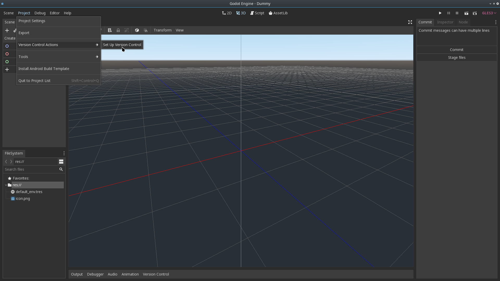
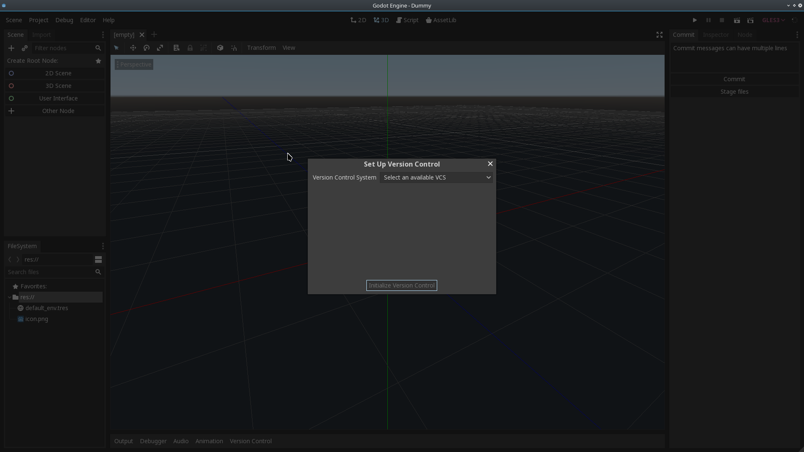

# 12th June 2019

I got the first PR related to VCS integration merged today. It doesn't do much instead of creating the GUI framework for the VCS integration to operate in and provide some class structure that will most likely be used in the future as I discussed with my mentors Groud and Jahd, after the clues we got in a meeting quite a while back with reduz.

Here are some screenshots for reference:

1. This includes:
	* A Version Control dock at the bottom (which will be populated shortly)
	* A Version Commit dock on the right hand side (A list of staged files and modified files is also planned, but not implemented yet)
	* A Version Control Actions popup menu under Project Menu at the top left (This should behave like a quick action toolbar for all things VCS in Godot)
	* A Version Control dedicated settings tab in the Project Settings menu. It current does do anything specific. I am planning to also let the VCS addon (a.k.a. implementation of the VCS API) add a bunch of VCS nature specific settings to this tab.

2. Choosing `Set Up Version Control` brings up this menu. This is to detect all the different VCS API implementations available with the engine. The initialise button does some basic registrations and it will also be providing the VCS implementations (GDNative plugin) the ability to provide their own initialisation steps depending on their nature and type.

Next steps are getting the VCS API up and the diff viewer so that we can test the integration by just simple string outputs before jumping straight to GDNative.

Cheers!
